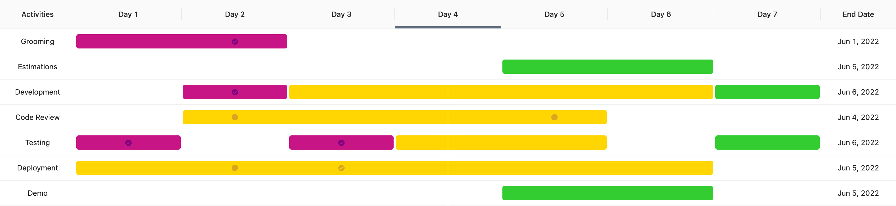
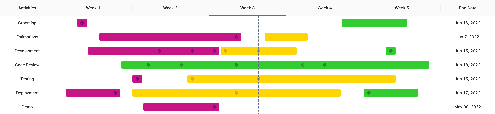

# Schedule Chart

Schedule in the form of Gantt chart implemented in React.

## Debug

- Manual using `Node.js`
- With docker using [VSCode devcontainers](https://code.visualstudio.com/docs/remote/containers)

## Build & Run

Source code located under `source` folder.

### Manual

- `yarn install`
- `yarn storybook`

### Docker

- `docker build -t react-schedule-chart .`
- `docker run --name ReactScheduleChart -dp 8080:80 react-schedule-chart`